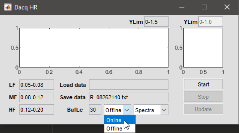
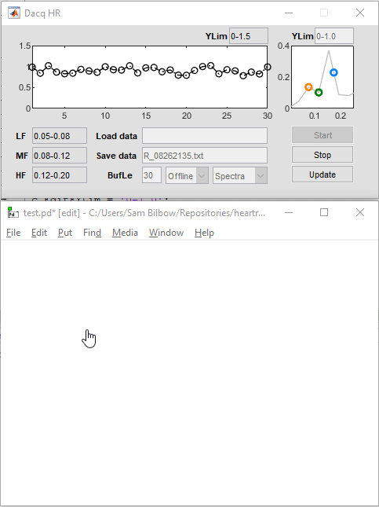
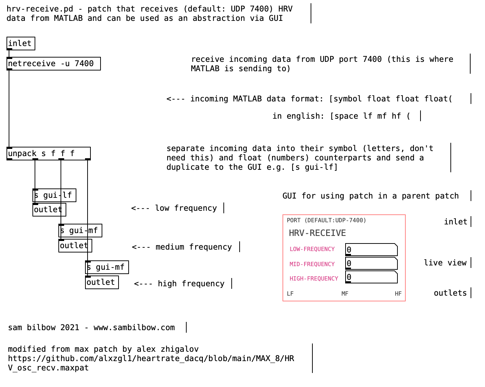
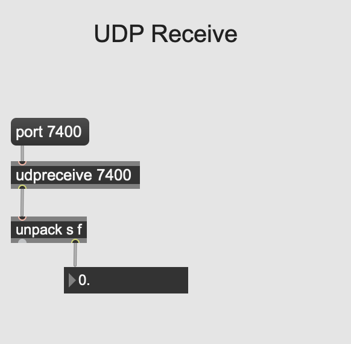

# Polar T34 HRV Data to Max MSP / Pure Data via OSC
This folder contains set of scripts to read data from POLAR T34 heart rate monitor via Arduino, do some basic data processing, and send HRV OSC messages via UDP 7400 to be picked up in Max MSP or Pure Data.

## Streaming OSC data
### Download and install MATLAB
1. Install Add-ons
    - Instrument Control
    - Arduino
2. Open gui_main.m
3. Select Run to start GUI

### Set up Arduino
`coming soon`

### Using/recording/streaming saved data from the Polar T34
1. Under "BufLe" select **"Offline"** and choose plot type (histo/spectra)
2. Paste file name "R_mmddHHMM.txt" for the file you want to plot and stream in the "Load Data" field.
3. Press Start
4. Press Update to start streaming OSC
5. Press Stop to save data to a new txt

### Using/recording/streaming (OSC) real-time data from the Polar T34
1. Under "BufLe" select **"Online"** and choose plot type (histo/spectra)

3. Rename "Save data" field if desired
4. Press Start
5. Press Update to start streaming OSC
6. Press Stop to save data to a new txt

## Receiving data in Pure Data using the [hrv-receive] object
Instructions|Screenshot
:-------------------------:|:-------------------------:
Include the [PureData Patch (hrv-receive.pd)](pure_data/hrv-receive.pd) in an existing patch folder, and use it by creating a new object called [hrv-receive] in this 'parent' patch to use the in-built GUI. This will  monitor and receive float HRV values from the OSC messages into an existing patch! |  
You can open up the hrv-receive object to see the workings PureData patch (very similar to the Max patch). The patch receives float HRV values from the OSC messages on the default UDP port of 7400.  The patch is automatically set up to receive the three (low, mid, high) frequency values from MATLAB|   

## Receiving data in Max MSP
Instructions|Screenshot
:-------------------------:|:-------------------------:
Use the [Max Patch](MAX_8/HRV_osc_recv.maxpat) to receive float HRV values from the OSC messages.  Use more "f" arguments in the unpack object, e.g. [unpack s f f f] to receive low, mid, **and** high frequency values|   

## Credits
The MATLAB code and Max MSP patch were created by [Alex Zhigalov](https://github.com/alxzgl1) under a [GNU General Public License](https://github.com/alxzgl1/heartrate_dacq/blob/main/LICENSE)

The PureData patch/object was created by [Sam Bilbow](https://github.com/sambilbow)
